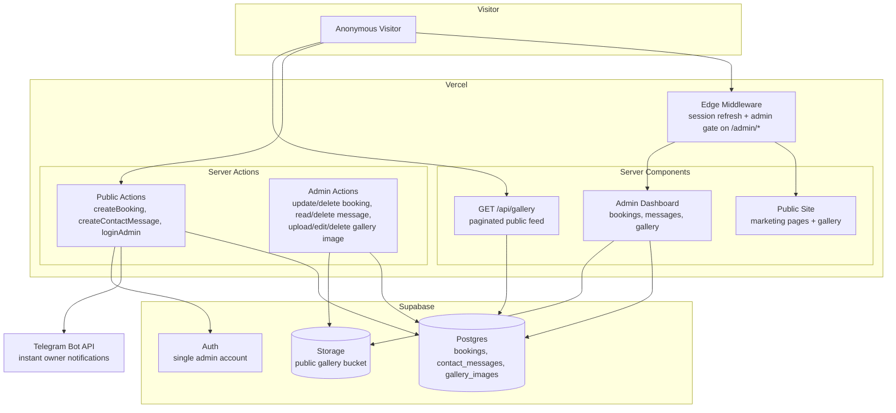
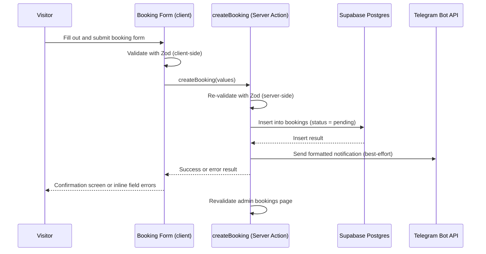
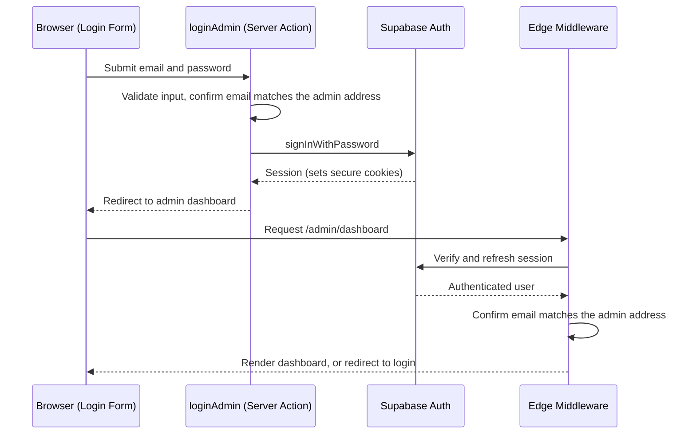
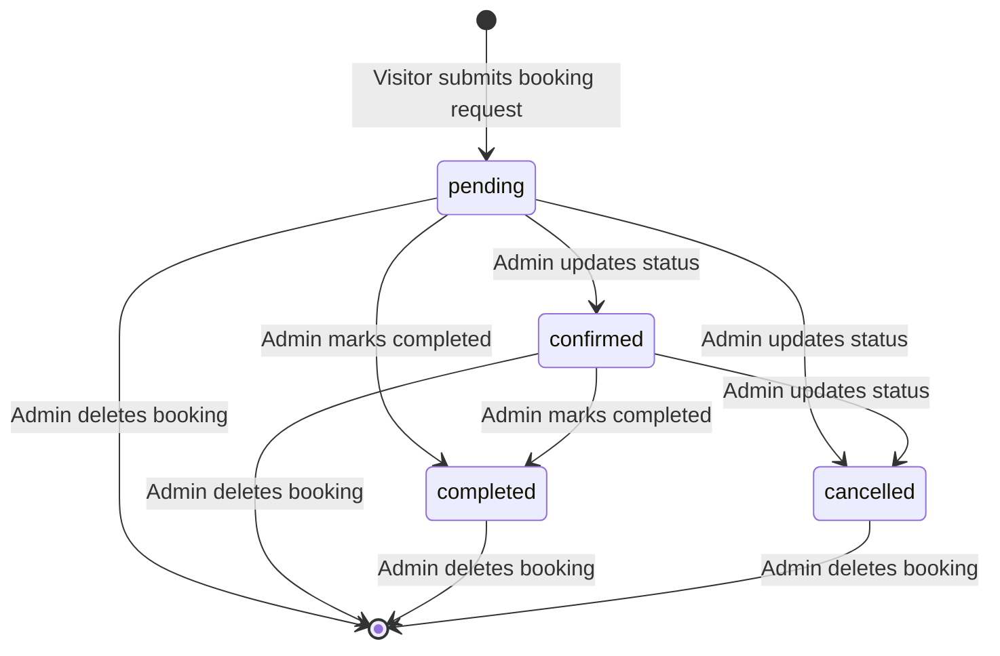
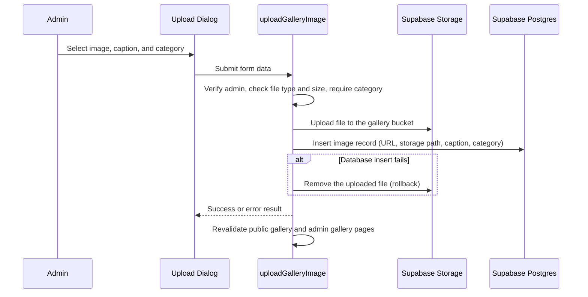
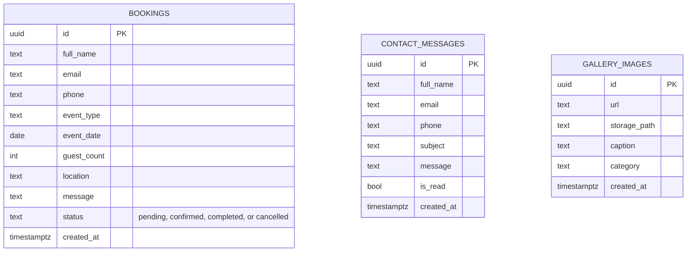

<div align="center">

# GJR EVENTS

### Premium event-management website with an integrated lead-generation pipeline

GJR Events is the production marketing and booking-intake website for a Hyderabad-based
event-management business. Visitors browse a portfolio gallery and service pages, then submit
booking or contact requests directly from the site. Every submission is validated, stored, and
instantly relayed to the owner via Telegram, replacing an informal WhatsApp-only inquiry
process with a structured, auditable pipeline.

Live site: [gjr-events.vercel.app](https://gjr-events.vercel.app)

This is a real, deployed client project actively used to generate and manage bookings for the
business, not a demo or template.


</div>

---

## Table of Contents

- [Overview](#overview)
- [What This Project Is Not](#what-this-project-is-not)
- [System Architecture](#system-architecture)
- [Booking Request Flow](#booking-request-flow)
- [Admin Authentication Flow](#admin-authentication-flow)
- [Booking Status Lifecycle](#booking-status-lifecycle)
- [Gallery Upload Flow](#gallery-upload-flow)
- [Database Schema](#database-schema)
- [Key Features](#key-features)
- [Technology Stack](#technology-stack)
- [API Reference](#api-reference)
- [Project Structure](#project-structure)
- [Environment Variables](#environment-variables)
- [Security](#security)
- [Performance](#performance)
- [Known Limitations](#known-limitations)
- [Getting Started](#getting-started)
- [Deployment](#deployment)
- [License](#license)

---

## Overview

GJR Events solves a simple business problem: give a single event-management company a premium
web presence and a structured way to capture leads, instead of relying on WhatsApp-only
inquiries. There is no ticketing, no attendee management, and no public user accounts — the
"event" concept in this system is a **booking request**, not an event entity.

**Who uses it:**

- **Prospective clients** (weddings, corporate events, birthdays, and similar) browse the site
  anonymously, view the gallery, and submit a booking or contact request.
- **The business owner** logs into a private admin dashboard to review and manage incoming
  bookings, read contact messages, and maintain the public gallery.

**Core pipeline:** a visitor fills out a form, the request is validated twice (client and
server), it is written to the database, the owner is notified instantly on Telegram, and the
admin dashboard reflects the new request in real time.

---

## What This Project Is Not

To keep expectations accurate, this system deliberately does not include:

- User-facing events, attendees, registrations, tickets, or payments
- Public user accounts or sign-up — only a single admin account exists
- Automated email or SMS notifications to visitors
- Any capacity limits, waitlists, or booking conflicts — a submission is simply a lead, not a
  reservation against inventory

---

## System Architecture



There is no separate backend server. Next.js Server Actions function as the entire backend
layer, with a single REST route (`GET /api/gallery`) for client-side pagination. All database
access uses the Supabase service-role key from server-only code — the browser never talks to
Postgres directly.

---

## Booking Request Flow

This is the core conversion path of the site: a visitor turning into a lead.



The Telegram notification is a non-blocking side effect: a Telegram outage never prevents a
booking from being saved, and a successful booking is never rolled back if the notification
fails.

---

## Admin Authentication Flow

A single admin account controls the entire back office. Identity is verified by matching the
signed-in Supabase user's email against a configured admin address.



Every admin mutation independently re-verifies the admin identity on the server, in addition to
the middleware and dashboard-layout checks, so access control does not depend on any single
layer.

---

## Booking Status Lifecycle

Bookings move through a simple, admin-driven status model. There is no automatic or
time-based transition — every change is a deliberate admin action.



---

## Gallery Upload Flow

The gallery is the only piece of dynamic public content on the site, and the admin dashboard
includes a full media-management workflow for it.



---

## Database Schema

Three independent tables, no foreign keys — each row is self-contained and there is no user
entity to relate bookings or messages to.



Row-level security is applied asymmetrically by design: `bookings` and `contact_messages` are
fully locked down and readable only through the server-side service-role key, while
`gallery_images` has an explicit public read policy since gallery content is meant to be
publicly visible.

---

## Key Features

### Public Marketing Site
Home, services, about, clients, and legal pages, built as static-content React Server
Components for fast loading and strong SEO.

### Filterable Gallery with Lightbox
Server-rendered initial results with client-side category filtering and true pagination against
a dedicated API route, plus a lightbox view for each image.

### Booking Request Form
A validated multi-field form — name, contact details, event type, date, estimated guest count,
location, and an optional message — that creates a lead with a single database insert.

### Contact Form
A lightweight alternative to the booking form for general inquiries, stored separately from
booking leads.

### Instant Owner Notifications
Every booking and contact submission triggers a real-time Telegram message to the business
owner, with all user-provided content safely escaped before formatting.

### Admin Dashboard
A private, authenticated area where the owner can:

- View summary statistics and recent bookings
- Search and filter all bookings, update their status, or delete them
- Read, mark as read or unread, and delete contact messages
- Upload, edit, and delete gallery images with captions and categories

### Defense-in-Depth Access Control
Admin access is checked at three independent layers — edge middleware, the dashboard layout,
and every individual admin action — so no single point of failure exposes admin capability.

---

## Technology Stack

<table>
<tr>
<td valign="top" width="50%">

**Frontend**


</td>
<td valign="top" width="50%">

**Backend and Data**


</td>
</tr>
<tr>
<td valign="top" width="50%">

**Integrations**


</td>
<td valign="top" width="50%">

**Deployment**


</td>
</tr>
</table>

| Technology | Role in the project |
|---|---|
| Next.js 15 (App Router) | Full application framework — routing, rendering, and Server Actions |
| React 19 + TypeScript | Type-safe, component-driven UI |
| Tailwind CSS v4 + shadcn/ui | Design system and accessible UI primitives |
| React Hook Form + Zod | Client-side form handling with shared client/server validation schemas |
| Framer Motion | Animation on the homepage hero |
| Supabase Postgres | Primary data store for bookings, messages, and gallery metadata |
| Supabase Auth | Authentication for the single admin account |
| Supabase Storage | Public storage bucket for gallery images |
| Telegram Bot API | Real-time lead notifications to the business owner |
| Vercel | Hosting and deployment |

---

## API Reference

| Method | Route | Purpose | Auth | Notes |
|---|---|---|---|---|
| `GET` | `/api/gallery` | Paginated public gallery feed | None | Supports `category`, `page`, and `pageSize` query parameters; results cached for 30 seconds |
| `GET` | `/robots.txt`, `/sitemap.xml` | SEO metadata | None | Admin and API routes are disallowed from indexing |
| — | Server Actions | All booking, contact, login, and admin-management operations | Public or admin-only, per action | Invoked directly from React components, not exposed as REST endpoints |

Every Server Action returns a consistent result shape indicating success or failure, with
field-level validation errors mapped back into the originating form.

---

## Project Structure

```
gjr-events/
├── middleware.ts                  # Edge middleware: session refresh + admin gate
├── next.config.ts                 # Security headers, image domains, request size limit
├── supabase/
│   └── schema.sql                 # Full database schema, RLS policies, storage bucket
├── types/                         # Shared TypeScript types
├── lib/
│   ├── env.ts                     # Environment variable validation
│   ├── constants.ts                # Site content: nav, services, testimonials, FAQs
│   ├── auth.ts                     # Admin identity checks
│   ├── telegram.ts                 # Telegram notification sender
│   ├── utils.ts                    # Formatting and shared helpers
│   ├── actions/                    # Server Actions — the application backend
│   │   ├── booking.ts               # Public booking submission
│   │   ├── contact.ts               # Public contact form submission
│   │   ├── auth.ts                  # Admin login and logout
│   │   ├── booking-admin.ts          # Admin booking management
│   │   ├── messages.ts               # Admin message management
│   │   └── gallery.ts                # Admin gallery management
│   ├── supabase/                    # Supabase client factories (browser, server, admin)
│   └── validations/                  # Shared Zod schemas
├── app/
│   ├── (site)/                       # Public marketing pages and gallery
│   ├── admin/                         # Login page and admin dashboard
│   └── api/gallery/route.ts           # The only REST endpoint
├── components/
│   ├── booking/ contact/ gallery/      # Feature-specific components
│   ├── admin/                           # Dashboard components
│   ├── layout/                           # Navbar and footer
│   ├── home/ shared/                      # Homepage sections and shared UI
│   └── ui/                                 # Design-system primitives
└── public/                                  # Static assets
```

---

## Environment Variables

| Variable | Purpose | Required |
|---|---|---|
| `NEXT_PUBLIC_SUPABASE_URL` | Supabase project URL | Yes |
| `NEXT_PUBLIC_SUPABASE_ANON_KEY` | Supabase anonymous key, used for session handling | Yes |
| `SUPABASE_SERVICE_ROLE_KEY` | Server-only key used for all database writes and most reads | Yes |
| `ADMIN_EMAIL` | The email address recognized as the admin account | Yes |
| `TELEGRAM_BOT_TOKEN` | Telegram bot token for owner notifications | Optional — notifications are skipped if unset |
| `TELEGRAM_CHAT_ID` | Destination chat for Telegram notifications | Optional |
| `WHATSAPP_PHONE` | Enables the floating WhatsApp contact button | Optional — button is hidden if unset |

The service-role key and admin email are only ever read in server-side code and are never
exposed to the browser.

---

## Security

- Admin routes are protected at three independent layers: edge middleware, the dashboard
  layout, and every individual admin Server Action.
- Row-level security is enabled on every table. Bookings and contact messages have no public
  policies at all — they are reachable only through the server-side service-role key. Gallery
  images have an explicit public read policy, since that content is meant to be public.
- All public input is validated with Zod on both the client and the server; validation covers
  field lengths, formats, date ranges, and enumerated values.
- File uploads are restricted by MIME type and size before being written to storage.
- React's automatic escaping prevents XSS, and all user-provided content sent to Telegram is
  explicitly HTML-escaped before being included in a message.
- Security headers are set at the application level, including frame-denial, content-type
  sniffing protection, and a restrictive permissions policy.
- Secrets are never committed and the service-role key is never imported into client-side code.

**Known gaps, disclosed for transparency:**

- There is no rate limiting or CAPTCHA on public form submissions or the gallery API, so both
  are exploitable for automated spam without additional protection at the hosting or network
  layer.
- Admin identity is a plain email-address comparison rather than a role table; anyone who
  authenticates as that email is treated as admin.
- The gallery's public read paths use the elevated service-role client rather than the
  anonymous key plus row-level security, which works correctly today but is a less
  defense-in-depth approach than relying on RLS alone.
- There is no Content Security Policy configured at the application level.

---

## Performance

- The gallery API uses real pagination with an exact result count, rather than loading
  everything at once.
- Public and admin pages use targeted cache invalidation after each mutation, so users see
  fresh data without a full page reload.
- Images are served through Next.js's built-in image optimization, with lazy loading applied to
  gallery grids.
- The admin dashboard overview loads its summary statistics with a single batch of parallel
  queries rather than sequential round-trips.

---

## Known Limitations

- Single-admin model — there is no multi-user or role-based admin system.
- No automated email or SMS notifications to visitors; all owner-side alerting goes through
  Telegram only.
- No booking capacity, conflict detection, or scheduling logic — a submission is a lead, not a
  confirmed reservation.
- The admin messages list currently loads without an upper bound, which is fine at current
  volume but would need pagination if message volume grows substantially.
- No automated test suite currently exists; correctness is enforced through TypeScript,
  validation schemas, and manual QA.

---

## Getting Started

### Prerequisites

- Node.js 18 or later
- npm or yarn
- A Supabase project (Postgres, Auth, and Storage)
- A Telegram bot token and chat ID, if notifications are desired

### Setup

```bash
git clone <repository-url>
cd gjr-events
npm install
```

Create a `.env.local` file with the variables listed in
[Environment Variables](#environment-variables), then run the database schema found in
`supabase/schema.sql` in the Supabase SQL editor and create the admin user through the Supabase
dashboard.

```bash
npm run dev
```

The site runs at `http://localhost:3000`.

---

## Deployment

The production site is deployed on Vercel at
[gjr-events.vercel.app](https://gjr-events.vercel.app), backed by Supabase for the database,
authentication, and file storage. Deployment is a standard Next.js build and start — no
containerization is used in this project. Required production configuration:

- The five Supabase and admin environment variables listed above
- The Telegram and WhatsApp variables, if those integrations are enabled
- The database schema applied via the Supabase SQL editor
- The admin user created manually through the Supabase Auth dashboard, with public sign-ups
  disabled

---

## License

This is a proprietary client project built for GJR Events. All rights reserved by the client;
this repository is not licensed for reuse or redistribution.

---

<div align="center">

A client project delivering a live, in-production booking platform for GJR Events, Hyderabad.

</div>
